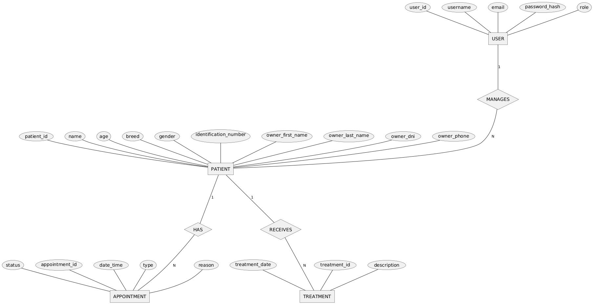
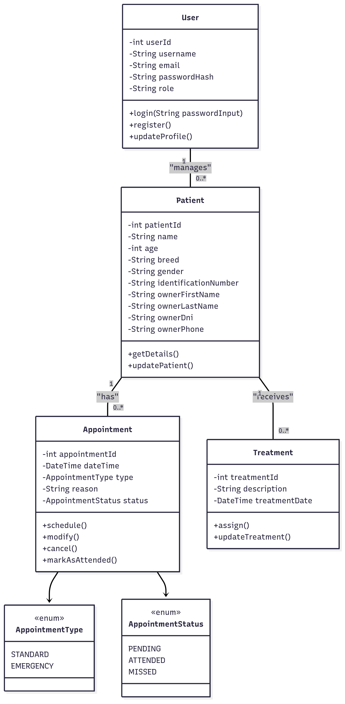
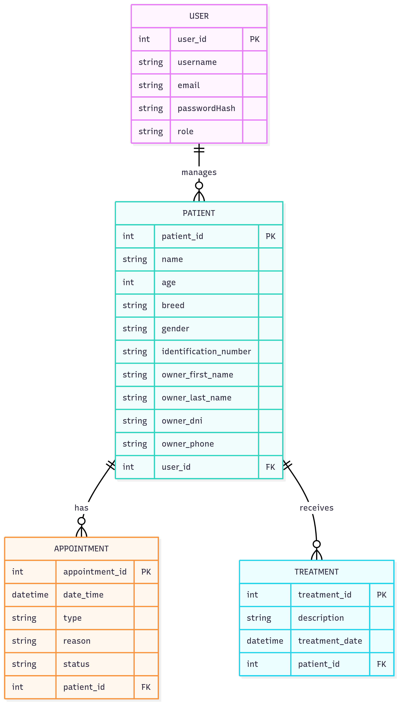

# Veterinary Clinic Backend 🐾

Una API REST desarrollada con Java y Spring Boot para la gestión de una clínica veterinaria.
Incluye funcionalidades de autenticación, autorización, gestión de pacientes, tratamientos, citas médicas y usuarios.

## 📋 Descripción

Veterinary Clinic Backend es un sistema diseñado para digitalizar y optimizar la gestión de una clínica veterinaria.
Permite manejar la información de pacientes (mascotas), usuarios (clientes y personal), tratamientos, roles, citas y seguridad de acceso mediante Spring Security.

## 🚀 Características

- **Gestión de usuarias**: Registro, autenticación y roles (Spring Security).
- **Administración de medicamentos**: CRUD de mascotas con historial clínico.
- **Sistema de recordatorios**: Programación y administración de citas veterinarias.
- **Gestión de tratamientos**: Registro de diagnósticos y tratamientos médicos.
- **Arquitectura modular**: Código organizado en módulos claros.
- **Gestión de roles y seguridad:**: Autorización basada en roles.
- **Documentación con Swagger**: API documentada automáticamente
- **Manejo de errores**: Sistema robusto de excepciones personalizadas

## 🛠️ Tecnologías

- **Java 21**
- **Spring Boot 3.5**
- **Spring Data JPA**
- **Spring Security**
- **Spring Data JPA**
- **Hibernate**
- **MySQL** (configurada via variables de entorno)
- **Swagger/OpenAPI 3** para documentación
- **Lombok** para reducir código boilerplate
- **Bean Validation** para validación de datos
- **JUnit 5** para testing

## 📁 Estructura del Proyecto

```
src/main/java/org/factoriaf5/
├── appointment/        # Módulo de gestión de citas
├── auth/               # Autenticación y login
├── config/             # Configuraciones (seguridad, swagger, etc.)
├── facade/             # Fachadas para comunicación entre capas
├── home/               # Endpoints de inicio / landing
├── patient/            # Gestión de pacientes (mascotas)
├── register/           # Registro de nuevos usuarios
├── role/               # Gestión de roles
├── security/           # Configuración de seguridad y JWT
├── treatment/          # Gestión de tratamientos médicos
└── user/               # Gestión de usuarios (dueños y personal)

```

## 🎯 Endpoints Principales

## 🎯 Endpoints Principales

### 🧑‍⚕️ **Treatment Controller**

- `POST /api/v1/treatments` → Crear un nuevo tratamiento
- `GET /api/v1/treatments/patient/{id}` → Obtener tratamientos de un paciente por ID

---

### 📝 **Register Controller**

- `POST /api/v1/register` → Registrar un nuevo usuario

---

### 🐾 **Patient Controller**

- `GET /api/v1/patients` → Listar todos los pacientes
- `POST /api/v1/patients` → Registrar un nuevo paciente
- `GET /api/v1/patients/{id}` → Obtener un paciente por ID
- `DELETE /api/v1/patients/{id}` → Eliminar un paciente por ID
- `GET /api/v1/patients/owner/{dni}` → Listar pacientes por DNI del dueño

---

### 📅 **Appointment Controller**

- `GET /api/v1/appointments` → Listar todas las citas
- `POST /api/v1/appointments` → Crear una nueva cita
- `DELETE /api/v1/appointments/{id}` → Eliminar una cita
- `PATCH /api/v1/appointments/{id}` → Actualizar cita
- `PATCH /api/v1/appointments/{id}/status` → Actualizar estado de una cita
- `GET /api/v1/appointments/patient/{id}` → Listar citas por paciente
- `GET /api/v1/appointments/available/{date}` → Consultar citas disponibles por fecha

---

### 🏠 **Home Controller**

- `GET /public` → Endpoint público
- `GET /private` → Endpoint privado (requiere autenticación)
- `GET /` → Endpoint raíz

---

### 👤 **User Controller**

- `GET /api/v1/users` → Listar todos los usuarios
- `GET /api/v1/users/{dni}` → Obtener usuario por DNI
- `DELETE /api/v1/users/{dni}` → Eliminar usuario por DNI
- `GET /api/v1/users/role/{roleName}` → Listar usuarios por rol
- `GET /api/v1/users/email/{email}` → Buscar usuario por email

---

### 🔑 **Auth Controller**

- `GET /api/v1/login` → Iniciar sesión

## ⚙️ Configuración

### Configuración de Base de Datos

La aplicación está configurada para:

- MySQL como motor de base de datos
- Crear tablas automáticamente (`create-drop`)
- Poblar con datos de prueba via `data.sql`
- Mostrar consultas SQL en consola

## 🏃 Ejecución

### Requisitos Previos

- Docker
- Docker Compose

### Pasos

1. Clona el repositorio:
   ```bash
   git clone <url-repo>
   ```
2. Accede al directorio del proyecto:

```
cd veterinary-clinic-backend
```

3. Levanta la aplicación con Docker Compose:

```
docker compose up
```

La aplicación estará disponible en `http://localhost:8080`

## 📖 Documentación

Una vez ejecutada la aplicación, accede a:

- **Swagger UI**: `http://localhost:8080/swagger-ui.html`
- **OpenAPI JSON**: `http://localhost:8080/v3/api-docs`

## 🧪 Testing

Ejecuta las pruebas:

```bash
mvn test
```

El proyecto incluye:

- Tests unitarios para servicios y controladores
- Tests de integración para endpoints
- Tests de entidades

## 📊 Diagramas





**Desarrollado con ❤️ y Spring Boot**
